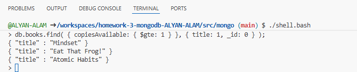
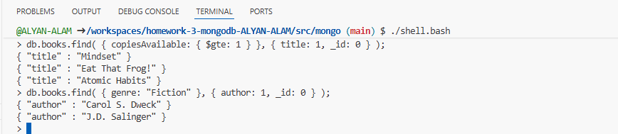
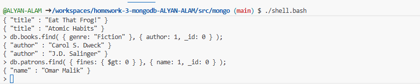
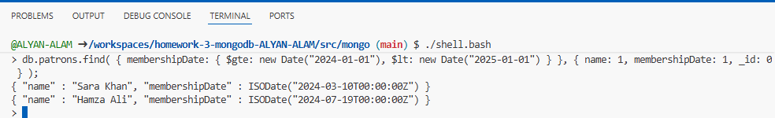

# Assignment 3 - Mongo

## Part 1 (10 pts): Day 1 - Reading

1. Read Day 1 and work through the examples. Dump your database into a
    directory named data.

    Completed

## Part 2 (10 pts): Day 1 - Find

Complete the "Find" homework in Day 1.

1. Bookmark the online MongoDB documentation and read up on something
    you found intriguing today. Provide the URL.

https://www.mongodb.com/docs/
https://www.mongodb.com/docs/manual/tutorial/query-embedded-documents/


2. Look up how to construct regular expressions in Mongo. Provide the URL.

https://www.mongodb.com/docs/manual/reference/operator/query/regex/


3. Acquaint yourself with command-line db.help() and db.collections.help() output.
    Nothing to provide.

Done

4. Find a Mongo driver in your programming language of choice (Ruby, Java,
    PHP, Go, Elixir, and so on). Provide URL to list of drivers/libraries for
    different languages.

https://www.mongodb.com/docs/languages/python/pymongo-driver/current/

## Part 3 (15 pts): Create and populate a database to hold library books and patrons.
For each of the steps below, provide the mongodb code that accomplishes this. Store your work in a folder called “Library”.

### Step 1: Create the Database

For this assignment, you will be working with the two collections described below. **Use the exact document and attribute names provided!**
* books - stores information about library books
    * Should use attributes of:  title, author, isbn, genre, publishedYear, copiesAvailable, and totalCopies
    * Make sure that some of your books are in the “Fiction” genre and some are in “Non-Fiction”
    * Make sure that at least two of your books have copies available to check out.
* patrons - stores information about library members
    * Should use attributes of:    name, email, membershipDate, booksCheckedOut (array of title and dueDate), and fines.
    * Make sure that at least one of your patrons has checked out more than one book.
    * Make sure that at least one of your patrons has an overdue fine.
    * Make sure that at least one of your patrons joined the library in 2004.

### Step 2: Insert Books into the Library
Insert six of your favorite books into the library.  Make sure that these are your favorite books, not randomly generated books.
```
db.books.insertOne({
  title: "Mindset",
  author: "Carol S. Dweck",
  isbn: "9780451524935",
  genre: "Fiction",
  publishedYear: 1949,
  copiesAvailable: 3,
  totalCopies: 5
});


db.books.insertOne({
  title: "Getting Things Done",
  author: "Yuval Noah Harari",
  isbn: "9780062316097",
  genre: "Non-Fiction",
  publishedYear: 2011,
  copiesAvailable: 0,
  totalCopies: 4
});


db.books.insertOne({
  title: "The Hobbit",
  author: "J.R.R. Tolkien",
  isbn: "9780547928227",
  genre: "Fiction",
  publishedYear: 1937,
  copiesAvailable: 2,
  totalCopies: 4
});

db.books.insertOne({
  title: "Eat That Frog!",
  author: "Tara Westover",
  isbn: "9780399590504",
  genre: "Non-Fiction",
  publishedYear: 2018,
  copiesAvailable: 1,
  totalCopies: 2
});


db.books.insertOne({
  title: "Deep Work",
  author: "J.D. Salinger",
  isbn: "9780316769488",
  genre: "Fiction",
  publishedYear: 1951,
  copiesAvailable: 0,
  totalCopies: 3
});


db.books.insertOne({
  title: "Atomic Habits",
  author: "James Clear",
  isbn: "9780735211292",
  genre: "Non-Fiction",
  publishedYear: 2018,
  copiesAvailable: 4,
  totalCopies: 5
});

```

### Step 3: Insert Patrons into the Library
Insert five of your friends as patrons into the library. Make sure that these are not randomly generated.

```
db.patrons.insertOne({
  name: "Alyan Alam",
  email: "alyan.alam@example.com",
  membershipDate: new Date("2004-05-20"),
  booksCheckedOut: [
    { title: "Mindset", dueDate: new Date("2025-10-25") },
    { title: "The Hobbit", dueDate: new Date("2025-11-01") }
  ],
  fines: 0
});

db.patrons.insertOne({
  name: "Sara Khan",
  email: "sara.khan@example.com",
  membershipDate: new Date("2024-03-10"),
  booksCheckedOut: [
    { title: "Getting Things Done", dueDate: new Date("2025-09-30") }
  ],
  fines: 0
});

db.patrons.insertOne({
  name: "Omar Malik",
  email: "omar.malik@example.com",
  membershipDate: new Date("2022-08-15"),
  booksCheckedOut: [
    { title: "Eat That Frog!", dueDate: new Date("2025-09-01") }
  ],
  fines: 10.50
});

db.patrons.insertOne({
  name: "Noor Fatima",
  email: "noor.fatima@example.com",
  membershipDate: new Date("2023-02-14"),
  booksCheckedOut: [
    { title: "Deep Work", dueDate: new Date("2025-10-15") }
  ],
  fines: 0
});

db.patrons.insertOne({
  name: "Hamza Ali",
  email: "hamza.ali@example.com",
  membershipDate: new Date("2024-07-19"),
  booksCheckedOut: [
    { title: "Atomic Habits", dueDate: new Date("2025-11-02") }
  ],
  fines: 0
});
```


### Step 4: Queries
For each of the queries below, write the query and include the results.

1. Write a query to find the titles of all books that have at least one copy available for checkout.


```
db.books.find( { copiesAvailable: { $gte: 1 } }, { title: 1, _id: 0 } );
```




2. Write a query to find the authors of all books in the "Fiction" genre.

```
db.books.find( { genre: "Fiction" }, { author: 1, _id: 0 } );

```


3. Write a query to find the names of all patrons who owe fines (fines greater than $0).

```
db.patrons.find( { fines: { $gt: 0 } }, { name: 1, _id: 0 } );
```


4. Write a query to find the names and membership date of all patrons who became members in the year 2024.

```
db.patrons.find( { membershipDate: { $gte: new Date("2024-01-01"), $lt: new Date("2025-01-01") } }, { name: 1, membershipDate: 1, _id: 0 } );
```


Hint: Use $gte and $lt operators to specify a date range from January 1, 2024 to January 1, 2025.

## Part 4 (10 pts): Day 2 - Do

Complete the "Find" homework in Day 2.

1. Find a shortcut for admin commands. Write the shortcut here.


2. Find the online documentation for queries and cursors. Write the URL here.

```
https://www.mongodb.com/docs/manual/reference/method/js-cursor/?utm_source=chatgpt.com#cursor-methods

https://www.mongodb.com/docs/manual/crud/#mongodb-crud-operations
```

3. Find the MongoDB documentation for mapreduce. Write the URL here.

```
https://www.mongodb.com/docs/manual/core/map-reduce/
```

4. Through the JavaScript interface, investigate the code for three collections
    functions: help(), findOne(), and stats(). Past the code for each below.
    For each, write a one-sentence insight that you learned by looking at
    the code.

    1.help()

    From the code the first thing i understand is that we store db name in shortname which we retrive using getName().
    Rest we have print statements which display the command and its brief discription.

    ```
    function () {
    var shortName = this.getName();
    print("DBCollection help");
    print("\tdb." + shortName + ".find().help() - show DBCursor help");
    print(
        "\tdb." + shortName +
        ".bulkWrite( operations, <optional params> ) - bulk execute write operations, optional parameters are: w, wtimeout, j");
    print(
        "\tdb." + shortName +
        ".count( query = {}, <optional params> ) - count the number of documents that matches the query, optional parameters are: limit, skip, hint, maxTimeMS");
    print(
        "\tdb." + shortName +
        ".countDocuments( query = {}, <optional params> ) - count the number of documents that matches the query, optional parameters are: limit, skip, hint, maxTimeMS");
    print(
        "\tdb." + shortName +
        ".estimatedDocumentCount( <optional params> ) - estimate the document count using collection metadata, optional parameters are: maxTimeMS");
    print(
        "\tdb." + shortName +
        ".copyTo(newColl) - duplicates collection by copying all documents to newColl; no indexes are copied.");
    print("\tdb." + shortName + ".convertToCapped(maxBytes) - calls {convertToCapped:'" +
          shortName + "', size:maxBytes}} command");
    print("\tdb." + shortName + ".createIndex(keypattern[,options])");
    print("\tdb." + shortName + ".createIndexes([keypatterns], <options>)");
    print("\tdb." + shortName + ".dataSize()");
    print(
        "\tdb." + shortName +
        ".deleteOne( filter, <optional params> ) - delete first matching document, optional parameters are: w, wtimeout, j");
    print(
        "\tdb." + shortName +
        ".deleteMany( filter, <optional params> ) - delete all matching documents, optional parameters are: w, wtimeout, j");
    print("\tdb." + shortName + ".distinct( key, query, <optional params> ) - e.g. db." +
          shortName + ".distinct( 'x' ), optional parameters are: maxTimeMS");
    print("\tdb." + shortName + ".drop() drop the collection");
    print("\tdb." + shortName + ".dropIndex(index) - e.g. db." + shortName +
          ".dropIndex( \"indexName\" ) or db." + shortName + ".dropIndex( { \"indexKey\" : 1 } )");
    print("\tdb." + shortName + ".dropIndexes()");
    print("\tdb." + shortName +
          ".ensureIndex(keypattern[,options]) - DEPRECATED, use createIndex() instead");
    print("\tdb." + shortName + ".explain().help() - show explain help");
    print("\tdb." + shortName + ".reIndex()");
    print(
        "\tdb." + shortName +
        ".find([query],[fields]) - query is an optional query filter. fields is optional set of fields to return.");
    print("\t                                              e.g. db." + shortName +
          ".find( {x:77} , {name:1, x:1} )");
    print("\tdb." + shortName + ".find(...).count()");
    print("\tdb." + shortName + ".find(...).limit(n)");
    print("\tdb." + shortName + ".find(...).skip(n)");
    print("\tdb." + shortName + ".find(...).sort(...)");
    print("\tdb." + shortName + ".findOne([query], [fields], [options], [readConcern])");
    print(
        "\tdb." + shortName +
        ".findOneAndDelete( filter, <optional params> ) - delete first matching document, optional parameters are: projection, sort, maxTimeMS");
    print(
        "\tdb." + shortName +
        ".findOneAndReplace( filter, replacement, <optional params> ) - replace first matching document, optional parameters are: projection, sort, maxTimeMS, upsert, returnNewDocument");
    print(
        "\tdb." + shortName +
        ".findOneAndUpdate( filter, update, <optional params> ) - update first matching document, optional parameters are: projection, sort, maxTimeMS, upsert, returnNewDocument");
    print("\tdb." + shortName + ".getDB() get DB object associated with collection");
    print("\tdb." + shortName + ".getPlanCache() get query plan cache associated with collection");
    print("\tdb." + shortName + ".getIndexes()");
    print("\tdb." + shortName + ".group( { key : ..., initial: ..., reduce : ...[, cond: ...] } )");
    print("\tdb." + shortName + ".insert(obj)");
    print(
        "\tdb." + shortName +
        ".insertOne( obj, <optional params> ) - insert a document, optional parameters are: w, wtimeout, j");
    print(
        "\tdb." + shortName +
        ".insertMany( [objects], <optional params> ) - insert multiple documents, optional parameters are: w, wtimeout, j");
    print("\tdb." + shortName + ".mapReduce( mapFunction , reduceFunction , <optional params> )");
    print(
        "\tdb." + shortName +
        ".aggregate( [pipeline], <optional params> ) - performs an aggregation on a collection; returns a cursor");
    print("\tdb." + shortName + ".remove(query)");
    print(
        "\tdb." + shortName +
        ".replaceOne( filter, replacement, <optional params> ) - replace the first matching document, optional parameters are: upsert, w, wtimeout, j");
    print("\tdb." + shortName +
          ".renameCollection( newName , <dropTarget> ) renames the collection.");
    print(
        "\tdb." + shortName +
        ".runCommand( name , <options> ) runs a db command with the given name where the first param is the collection name");
    print("\tdb." + shortName + ".save(obj)");
    print("\tdb." + shortName + ".stats({scale: N, indexDetails: true/false, " +
          "indexDetailsKey: <index key>, indexDetailsName: <index name>})");
    // print("\tdb." + shortName + ".diskStorageStats({[extent: <num>,] [granularity: <bytes>,]
    // ...}) - analyze record layout on disk");
    // print("\tdb." + shortName + ".pagesInRAM({[extent: <num>,] [granularity: <bytes>,] ...}) -
    // analyze resident memory pages");
    print("\tdb." + shortName +
          ".storageSize() - includes free space allocated to this collection");
    print("\tdb." + shortName + ".totalIndexSize() - size in bytes of all the indexes");
    print("\tdb." + shortName + ".totalSize() - storage allocated for all data and indexes");
    print(
        "\tdb." + shortName +
        ".update( query, object[, upsert_bool, multi_bool] ) - instead of two flags, you can pass an object with fields: upsert, multi");
    print(
        "\tdb." + shortName +
        ".updateOne( filter, update, <optional params> ) - update the first matching document, optional parameters are: upsert, w, wtimeout, j");
    print(
        "\tdb." + shortName +
        ".updateMany( filter, update, <optional params> ) - update all matching documents, optional parameters are: upsert, w, wtimeout, j");
    print("\tdb." + shortName + ".validate( <full> ) - SLOW");
    print("\tdb." + shortName + ".getShardVersion() - only for use with sharding");
    print("\tdb." + shortName +
          ".getShardDistribution() - prints statistics about data distribution in the cluster");
    print(
        "\tdb." + shortName +
        ".getSplitKeysForChunks( <maxChunkSize> ) - calculates split points over all chunks and returns splitter function");
    print(
        "\tdb." + shortName +
        ".getWriteConcern() - returns the write concern used for any operations on this collection, inherited from server/db if set");
    print(
        "\tdb." + shortName +
        ".setWriteConcern( <write concern doc> ) - sets the write concern for writes to the collection");
    print(
        "\tdb." + shortName +
        ".unsetWriteConcern( <write concern doc> ) - unsets the write concern for writes to the collection");
    print("\tdb." + shortName +
          ".latencyStats() - display operation latency histograms for this collection");
    return __magicNoPrint;
      }
    ```

    2.findOne()

    After looking the code i understand that it used regex with some parameters like limit, batchsize etc. to find the data
    ```
    function (query, fields, options, readConcern, collation) {
    var cursor = this.find(query, fields, -1 /* limit */, 0 /* skip*/, 0 /* batchSize */, options);

    if (readConcern) {
        cursor = cursor.readConcern(readConcern);
    }

    if (collation) {
        cursor = cursor.collation(collation);
    }

    if (!cursor.hasNext())
        return null;
    var ret = cursor.next();
    if (cursor.hasNext())
        throw Error("findOne has more than 1 result!");
    if (ret.$err)
        throw _getErrorWithCode(ret, "error " + tojson(ret));
    return ret;
      }
    ```

    3.stats()

    Here after exploring stats code i understand that first it check some kind of comatibility then it get some details and filter some to give us the results at the end.
    ```
    function (args) {
    'use strict';

    // For backwards compatibility with db.collection.stats(scale).
    var scale = isObject(args) ? args.scale : args;

    var options = isObject(args) ? args : {};
    if (options.indexDetailsKey && options.indexDetailsName) {
        throw new Error('Cannot filter indexDetails on both indexDetailsKey and ' +
                        'indexDetailsName');
    }
    // collStats can run on a secondary, so we need to apply readPreference
    var res = this._db.runReadCommand({collStats: this._shortName, scale: scale});
    if (!res.ok) {
        return res;
    }

    var getIndexName = function(collection, indexKey) {
        if (!isObject(indexKey))
            return undefined;
        var indexName;
        collection.getIndexes().forEach(function(spec) {
            if (friendlyEqual(spec.key, options.indexDetailsKey)) {
                indexName = spec.name;
            }
        });
        return indexName;
    };

    var filterIndexName = options.indexDetailsName || getIndexName(this, options.indexDetailsKey);

    var updateStats = function(stats, keepIndexDetails, indexName) {
        if (!stats.indexDetails)
            return;
        if (!keepIndexDetails) {
            delete stats.indexDetails;
            return;
        }
        if (!indexName)
            return;
        for (var key in stats.indexDetails) {
            if (key == indexName)
                continue;
            delete stats.indexDetails[key];
        }
    };

    updateStats(res, options.indexDetails, filterIndexName);

    if (res.sharded) {
        for (var shardName in res.shards) {
            updateStats(res.shards[shardName], options.indexDetails, filterIndexName);
        }
    }

    return res;
    }

    ```
